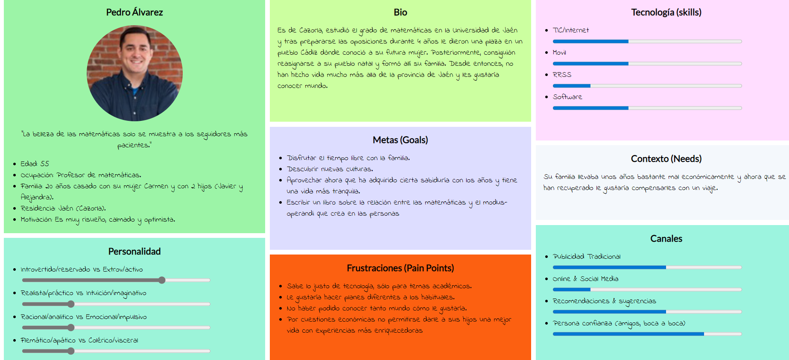
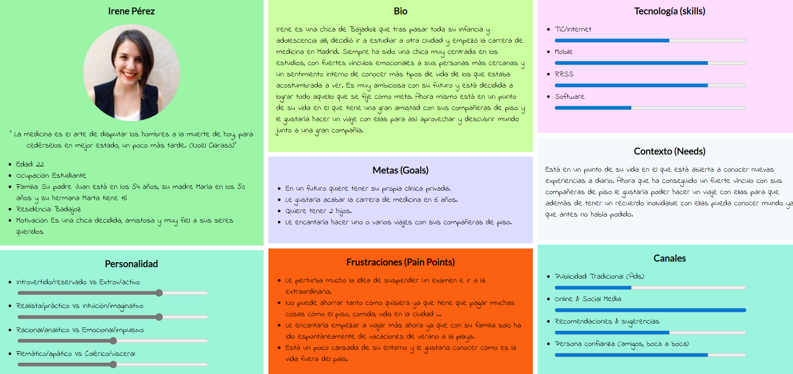

## DIU - Practica1, entregables

- Desk research: Análisis Competencia 
- 2 Personas 
- 2 User Journey Map  ( 1 por persona)
- Revisión de Usabilidad 

# Proceso de Diseño 

## Paso 1. UX Desk Research & Analisis 

 1.a Competitive Analysis
-----
Hemos analizado un total de 3 plataformas de experiencias y planificación de ocio:

Por un lado tenemos a SpainInfo, que es una web que se dedica a la planificación de viajes, rutas, y posibles itinerarios que podrían interesarle al usuario, centrada exclusivamente en el territorio español. Más bien es una página informativa con todo lo relacionado a cómo organizar tu viaje, posibles destinos, y propuestas de viaje en España.

Otra web interesante es la de Civitatis, que además posee una app para móvil. Podemos acceder a una amplia gama de viajes y guías de viajes por todo el mundo para viajar en grupo o por tu cuenta. Así como experiencias o actividades de casi cualquier temática, desde free tours, excursiones, visitas guiadas, paseos en barco, autobuses turísticos, espectáculos, experiencias gastronómicas o incluso darte una vuelta en helicóptero.

Por último, nos encontramos con BuscoUnViaje, en la cual se abarca una posibilidad de destinos global y nos permite compartir la experiencia adaptándonos a un grupo, en la mayoría de ocasiones con un guía privado. Realmente podemos ver a esta plataforma como punto de encuentro del usuario con las agencias especializadas en algún viaje/destino o actividad/experiencia concreta, de manera que facilita la interacción entre el usuario y estas.

Por último, encontramos la web Civitatis, que además posee una app para móvil. Podemos acceder a una amplia gama de viajes y guías de viajes por todo el mundo para viajar en grupo o por tu cuenta. Así como experiencias o actividades de casi cualquier temática, desde free tours, excursiones, visitas guiadas, paseos en barco, autobuses turísticos, espectáculos, experiencias gastronómicas o incluso darte una vuelta en helicóptero.

Tabla comparativa de los casos estudiados:

|EMPRESAS                         | SpainInfo         | Civitatis            | BuscoUnViaje  | 
| :------:                        | :------:          | :------:             |  :------:     | 
| Formato                         | Solo Web          |  Web y App           |   Solo Web    | 
| Búsqueda por:                   |                   |                      |               |
| -*Temática*                     | Si                |  Si                  | Si            |
| -*Duración*                     | Si                |  Si                  | No            |
| -*Fecha*                        | Si                |  Si                  | Si            |
| -*Precio*                       | Si                |  Si                  | Si            | 
| -*Lugar*                        | Si                |  Si                  | Si            |
| -*Opción Grupo/Privado/Libre*   | No                |  No                  | Si            |
| Reserva                         | Web Externa       |  Misma página        | Web Externa   |
| Gratuito & Pago                 | Ambas             |  Ambas               | Ambas         |
| Elegir Número de personas       | No                |  Si                  | Si            |
| Fotografías Eventos             | Si                |  Si                  | Si            |
| Reseñas                         | No                |  Si                  | Si            |
| Contacto                        | Enviar formulario |  Enviar Formulario   | Nº Telefono o Enviar formulario       |
| Idiomas                         | 8 disponibles     |  4 disponibles       | Solo español  |
| Cuenta                          | No                |  Si                  | No            |
| Aparencia                       | Compleja          |  Sencilla            | Sencilla      |
| Conversion Moneda               | No                |  Si                  | No            |

Hemos elegido Civitatis porque aporta la mayoría de opciones que nos dan los demás portales y tiene ventajas únicas. Entre ellas encontramos a nuestra disposición una app para móvil, cuenta propia dentro de la página, poder reservar en la propia página sin que nos redirija a un dominio externo, conversión a moneda y una web amigable en la que es fácil navegar para cualquier tipo de usuario.

 1.b Persona
-----

>>> Comenta brevemente porqué has seleccionado a esas personas y sube una captura de pantalla de su ficha  (80-150 caracteres)

 1.c User Journey Map
----

>>> Comenta brevemente porqué has escogido estas dos experiencias de usuario (y si consideras que son habituales) (80-150 caracteres) 

 1.d Usability Review
----
>>>  Revisión de usabilidad: (toma los siguientes documentos de referncia y verifica puntos de verificación de  usabilidad
>>>> SE deben incluir claramente los siguientes elementos
>>> - Enlace al documento:  (sube a github el xls/pdf) 
>>> - Valoración final (numérica): 
>>> - Comentario sobre la valoración:  (60-120 caracteres)
