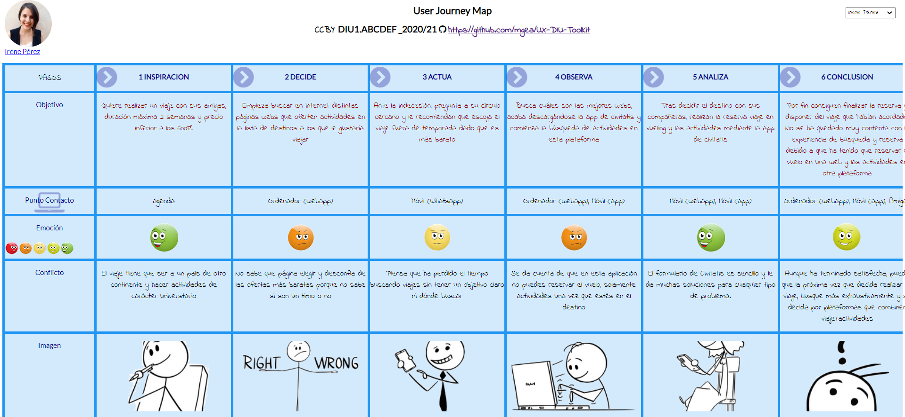

## DIU - Practica1, entregables

- Desk research: Análisis Competencia 
- 2 Personas 
- 2 User Journey Map  ( 1 por persona)
- Revisión de Usabilidad 

# Proceso de Diseño 

## Paso 1. UX Desk Research & Analisis 

 1.a Competitive Analysis
-----

Hemos analizado un total de 3 plataformas de experiencias y planificación de ocio:     Por un lado tenemos a SpainInfo, que es una web que se dedica a la planificación de viajes, rutas, y posibles itinerarios que podrían interesarle al usuario, centrada exclusivamente en el territorio español. Más bien es una página informativa con todo lo relacionado a cómo organizar tu viaje, posibles destinos, y propuestas de viaje en España.     Otra web interesante es la de Civitatis, que además posee una app para móvil. Podemos acceder a una amplia gama de viajes y guías de viajes por todo el mundo para viajar en grupo o por tu cuenta. Así como experiencias o actividades de casi cualquier temática, desde free tours, excursiones, visitas guiadas, paseos en barco, autobuses turísticos, espectáculos, experiencias gastronómicas o incluso darte una vuelta en helicóptero.     Por último, nos encontramos con BuscoUnViaje, en la cual se abarca una posibilidad de destinos global y nos permite compartir la    experiencia adaptándonos a un grupo, en la mayoría de ocasiones con un guía privado. Realmente podemos ver a esta plataforma como punto de encuentro del usuario con las agencias especializadas en algún viaje/destino o actividad/experiencia concreta, de manera que facilita la interacción entre el usuario y estas.     Por último, encontramos la web Civitatis, que además posee una app para móvil. Podemos acceder a una amplia gama de viajes y guías de viajes por todo el mundo para viajar en grupo o por tu cuenta. Así como experiencias o actividades de casi cualquier temática, desde free tours, excursiones, visitas guiadas, paseos en barco, autobuses turísticos, espectáculos, experiencias gastronómicas o incluso darte una vuelta en helicóptero.

Tabla comparativa de los casos estudiados:

|EMPRESAS                         | SpainInfo         | Civitatis            | BuscoUnViaje  | 
| :------:                        | :------:          | :------:             |  :------:     | 
| Formato                         | Solo Web          |  Web y App           |   Solo Web    | 
| Búsqueda por:                   |                   |                      |               |
| -*Temática*                     | Si                |  Si                  | Si            |
| -*Duración*                     | Si                |  Si                  | No            |
| -*Fecha*                        | Si                |  Si                  | Si            |
| -*Precio*                       | Si                |  Si                  | Si            | 
| -*Lugar*                        | Si                |  Si                  | Si            |
| -*Opción Grupo/Privado/Libre*   | No                |  No                  | Si            |
| Reserva                         | Web Externa       |  Misma página        | Web Externa   |
| Gratuito & Pago                 | Ambas             |  Ambas               | Ambas         |
| Elegir Número de personas       | No                |  Si                  | Si            |
| Fotografías Eventos             | Si                |  Si                  | Si            |
| Reseñas                         | No                |  Si                  | Si            |
| Contacto                        | Enviar formulario |  Enviar Formulario   | Nº Telefono o Enviar formulario       |
| Idiomas                         | 8 disponibles     |  4 disponibles       | Solo español  |
| Cuenta                          | No                |  Si                  | No            |
| Aparencia                       | Compleja          |  Sencilla            | Sencilla      |
| Conversion Moneda               | No                |  Si                  | No            |

Hemos elegido Civitatis porque aporta la mayoría de opciones que nos dan los demás portales y tiene ventajas únicas. Entre ellas encontramos a nuestra disposición una app para móvil, cuenta propia dentro de la página, poder reservar en la propia página sin que nos redirija a un dominio externo, conversión a moneda y una web amigable en la que es fácil navegar para cualquier tipo de usuario.

 1.b Persona
-----

Por un lado tenemos a Pedro, una persona calmada y muy dedicada en su trabajo, con ganas de tomar un descanso y pasar tiempo con su familia. No tiene mucho manejo con las tecnologias aparte de lo necesario para su trabajo, por lo que será un obstáculo que tendrá que superar en este proceso.
 

En el caso de Irene tenemos un perfil algo distinto al anterior. Aún estudiante, y tieniendo toda la vida por delante se decide a hacer planes con sus compañeras de piso y conocer mundo. Algo impaciente e impulsiva, aunque con más experiencia en tecnologías y redes sociales que Pedro.
 

 1.c User Journey Map
----
Ambas experiencias se parecen en rasgos generales, pues los 2 al final consiguen su objetivo final. Pero Pedro opta por utilizar la web, mientras que Irene vé más cómodo planear todo desde la app del móvil. Algo en lo que coinciden, y seguramente la mayoria de usuarios también, es que no les gusta tener que gestionar el traslado aparte.

 1.d Usability Review
----
- Revisión de Usabilidad

>>>  - Enlace al documento pdf: [pulse aqui](https://github.com/angelsc21/DIU21/blob/master/P1/Usability-review.pdf) 

>>>  - Valoración final: 80
>>>  - Comentario sobre la valoración:
>>>  
>>>  <h3>Características y Funcionalidad:</h3>
>>>  

>>>  En líneas generales está bastante bien. Se cumplen las metas y objetivos comunes, las tareas son fácilmente accesibles y las acciones están bien etiquetadas. La pega en este apartado es que tanto si eres experto cómo un novato pasarás por el mismo camino.
>>>  

>>>  <h3>Página de Inicio:</h3>
>>>  

>>>      Es uno de los puntos fuerte de la página, presenta una interfaz sencilla y clara que proporciona las características básicas de las funcionalidades de la página.
>>>  

>>>  <h3>Navegación:</h3>
>>>  

>>>     La página es accesible desde cualquier navegador y presenta una url predecible. Los distintos enlaces están bien etiquetados y es fácil ubicarte si tienes un manejo estándar.
>>>  

>>>  <h3>Búsqueda:</h3>
>>>  

>>>     Es otro de los puntos fuertes de esta página. La función de búsqueda está siempre disponible, interfaz muy accesible, muestra resultados correctamente y suele corregir la mayoría de faltas de ortografía. La única pega es que no maneja abreviaciones en la mayoría de los casos.
>>>  

>>> <h3>Control y  Feedback:</h3>
>>>  

>>>    Las respuestas son rápidas y pertinentes. Es fácil deshacer acciones erróneas y se puede contactar por email. Aquí se echa de menos un número de contacto (a la vista) o un asistente en línea.
>>>  

>>>  <h3>Formularios:</h3>
>>>  

>>>    Se divide en secciones claramente diferenciadas, no pide una gran cantidad de datos, marca aquellos que son obligatorios y la ayuda es poco eficiente. 
>>>  

>>>  <h3>Errores:</h3>
>>>  

>>>    El error se notifica de forma clara en lenguaje natural (sin códigos para usuarios expertos). Es fácilmente recuperarse de un error retrocediendo en el navegador o simplemente clickando en el logo para ir a la página de inicio.
>>>  

>>>  <h3>Contenido y texto:</h3>
>>>  

>>>    Contenido relevante y útil para el usuario en la mayoría de los casos. Terminología común y hay consistencia en el lenguaje. El contenido es fácil de leer y escaneable si el navegador proporciona dicha función.
>>>  

>>>  <h3>Ayuda:</h3>
>>>  

>>>    Es uno de los puntos a mejorar por esta web. La ayuda es insuficiente y poco variada. Únicamente poseen de un listado de preguntas frecuentes y un formulario que se envía por email a la vista (el tlf y chat de telegram están muy escondidos). Por otra parte, la ayuda es bastante accesible y te permite seguir navegando ya que se presenta en modo de pop-up.
>>>  

>>>  <h3>Rendimiento:</h3>
>>>  

>>>   Tanto la página web cómo la app responden rápidamente y sin problemas. 
>>>  

<h3>CONCLUSIÓN</h3>

Para resumir esta práctica vamos a comentar los puntos más interesantes y que nos han sorprendido. Lo primero sería lo difícil que es encontrar un sitio web que recoja la mayoría de nuestros objetivos. Unos tienen reserva de vuelo + actividades, otros solo actividades ... Otra cuestión a resaltar, rara es la vez que se distingue el nivel de experiencia del usuario, por lo que alcanzar tu objetivo dependerá de lo fácil o difícil que sea la interfaz de usar. El tema de crear personajes también nos ha sorprendido debido a que trae más complejidad de lo que uno cree. Para finalizar, esta práctica nos ha enseñado un gran número de dificultades a las que se enfrentan los usuarios y que antes no percibíamos.

