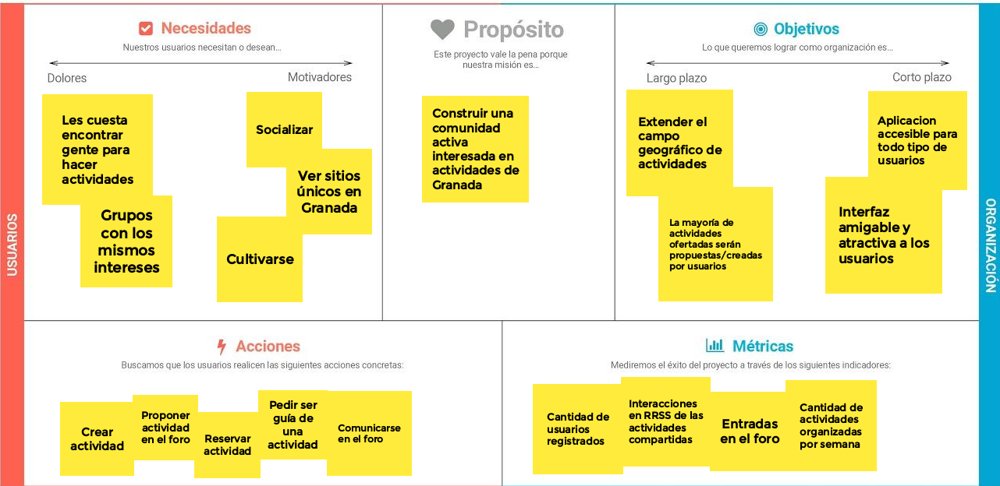
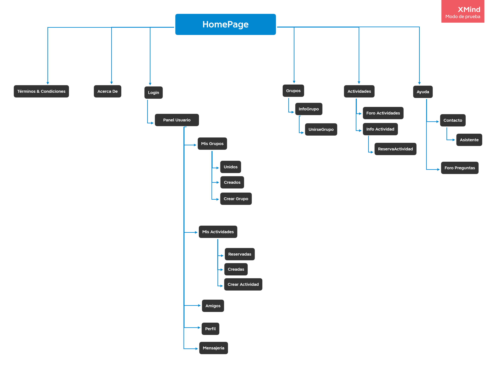
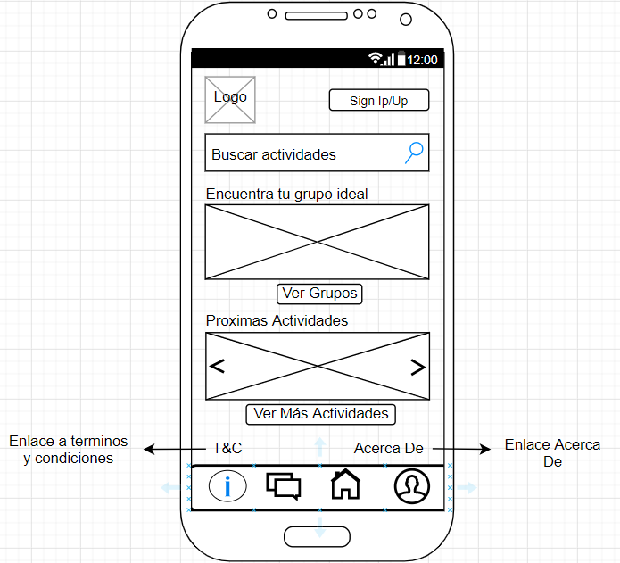
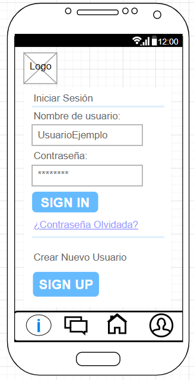

## DIU - Practica2, entregables

### Ideación 
* Malla receptora de información 

| 
<strong>Interesante</strong>
 | 
<strong>Críticas</strong>
|  
| ------------- | -------|
| Es muy sencillo unirse a un tour.| No distingue el nivel de experiencia de usuario para el uso de la web/app.|
| Implantan medidas anti-covid en los grupos (límite de personas).| Contacto con el soporte de la página parcialmente escondido.|
| Gran cantidad de tours por las ciudades más emblemáticas.| No permite ni crear ni proponer tours|
| Facilita la reserva hasta 15 minutos antes (en muchos tours)|Permite reservar sin estar registrado, propenso a ataques|
| Cancelación gratuita respetando los límites| |
|  
<strong>Preguntas</strong>
  | 
<strong>Nuevas Ideas</strong>
 |
|Cómo contactar con el guía de la actividad.|Permitir la creación de un tour|
|No hay opción de compartir el evento por RSS|Solicitar ser el guía de una actividad.|
|Quién verifica si esa actividad es real o fake|Filtrar cómo se enseñan las valoraciones de una actividad....|
|Posibilidad de recompensar al guía económicamente/valorando positivamente tras un tour (exclusivamente al guía, no a la actividad cómo tal)| Posibilidad de proponer tours y que otro usuario o trabajador de empresa lo organice. | Dividir las actividades por categorías.

### PROPUESTA DE VALOR

Nuestro proyecto consistirá en crear un sitio web claro, sencillo y funcional para todos aquellos usuarios que deseen realizar actividades en la provincia de Granada. Cualquier usuario podrá buscar actividades de su interés, grupos a los que unirse, crear un grupo ... y cómo innovación principal incluiremos la opción de que un usuario pueda crear una actividad o proponerla en el foro de actividades por si un trabajador de la página u otro usuario  puede llevarla a cabo. También existirá la posibilidad de pedir ser guía de una actividad para aquellos usuarios interesados (es una buena oportunidad para estudiantes de turismo).  

Un usuario estándar cuándo acceda a la web encontrará todo tipo de facilidades a la hora de búsqueda de actividades con una interfaz clara y sencilla.

Además de ofrecer la posibilidad de unirse a una actividad, el usuario (si está registrado) también podrá crearla o proponer la idea (no hace falta estar registrado) en el foro para que otro usuario o administradores de la web decidan crearla. 

En la página se podrán hacer grupos de usuarios que tengan afinidad, mismas motivaciones ... creando así un ambiente de comunidad. 

Existirá un foro de actividades a modo de tablón de anuncios dónde apareceran las actividades más próximas a su fin, actividades propuestas ...
 

Los usuarios pueden registrarse para beneficiarse de una interfaz sencilla en la que podrán ver sus actividades, grupos, amigos, perfil y mensajería.

Respecto a la ayuda al cliente, contaremos con varios asistentes en línea 24/7 que los usuarios podrán solicitar para solventar sus problemas. Además, contaremos con un e-mail de contacto y varios números de teléfono. También, existirá un foro de dudas frecuentes en el que podremos investigar y hacer nuevas preguntas.

### TASK ANALYSIS

* User Task Matrix 

Grupo Users 1: Usuarios que visita la web con frecuencia (registrado). 
Grupo Users 2: Usuarios Casual (no registrado). Típico usuario que se mete a curiosear para buscar una actividad puntual. 
Grupo Users 3: Usuario Creador. Tiene la posibilidad de crear actividades. 
Grupo Users 4: Usuarios extranjeros (de otro páis o vive en españa lejos de Granada)(no registrado).  

Leyenda : B (Baja), M(Media), A(Alta), No(No Permitido)   

| 
<strong>Grupos de Usuarios</strong>
 |  
<strong>Grupo 1</strong>
| 
<strong>Grupo2</strong>
 | 
<strong>Grupo3</strong>
| 
<strong>Grupo 4</strong>
 |
| ------------- | -------|   -------|  -------|  -------|
| Buscar Actividades | A  | A  | B | A |
| Proponer Actividad | M  | B  | A | B |
| Reservar Actividad | A  | M  | B | M |
| Crear Actividad    | No  | No | A | No |
| Pagar actividad | M  | B  | B | B |
| Valorar Actividad  | A | B | B | M |
| Foro Actividades | A | B | M | M |
| Buscar Grupos | A  | M  | B | M |
| Unirse a Grupo | M | No | B | No |
| Crear Grupo | M  | No | A | No |
| Registrarse | A | B | A | B |
| Checkear notificaciones | M | No | A | No |
| Mandar mensaje usuario | M  | B | M | B | 
| Añadir usuario amigo | M | No | M | No | 
| Visitar perfil de otro usuario | M | B | M | B | 
| Foro Dudas | M  | B | B | M |
| Checkear notificaciones | M | No | A | No |
| Solicitar ser guía | M | B | A | B |
| Leer Términos y Condiciones | M  | B  | A | B | 
| Leer Acerca De | M  | B | M  | B | 
| Elegir Idioma | B  | B  | B | A | 

### ARQUITECTURA DE INFORMACIÓN

* Sitemap 

* Labelling 

| 
<strong>Label</strong>
 |  
<strong>Scope Note</strong>
|
| ------------- | -------| 
| Terminos y Condiciones | Acuerdo de voluntades entre la aplicación y usuario por el cual se pactan derechos y obligaciones que ambas partes asumirán.  | 
| Acerca De | Información sobre la empresa detrás de la aplicación  | 
| Login | Identificación del usuario en la plataforma  | 
| Panel de Usuario | Apartado de acceso único a usuarios registrados en el que podrán gestionar sus grupos, actividades ...   | 
| Mis Grupos | Panel que clasifica los grupos del usuario y la opción de crear uno | 
| Unidos | Grupos a los que se ha unido el usuario | 
| Creados | Grupos que ha creado el usuario | 
| Crear Grupo | Interfaz de creación de grupo | 
| Mis Actividades | Panel que clasifica las actividades del usuario y la opción de crear una | 
| Reservadas | Actividades reservadas por el usuario | 
| Creadas | Actividades creadas por el usuario  | 
| Crear Actividad | Interfaz de creación de actividad  | 
| Amigos | List de amigos del usuario | 
| Perfil | Perfil de usuario con información personal  | 
| Mensajeria | Chat del usuario en el que se muestran las conversaciones  | 
| Grupos | Catálogo de grupos creados en la aplicación | 
| Info Grupo | Información de un grupo concreto de la aplicación | 
| Unirse Grupo | Formulario para acceder a un grupo | 
| Actividades | Catálogo de actividades creadas en la aplicación  | 
| Foro Actividades | Foro en el que se publican las actividades próximas a su fin, actividades propuestas ...  | 
| Info Actividad | Información de una actividad concreta  | 
| Reserva Actividad | Formulario para reservar una actividad  | 
| Ayuda | Sección de ayuda al cliente  | 
| Contacto | Listado de distintas vías de ayuda | 
| Asistente | Asistente online que interactua con el usuario para resolver sus dudas  | 
| Foro Preguntas | Preguntas frecuentes ya resueltas | 

### Prototipo Lo-FI Wireframe 

<h3>

<strong>HOMEPAGE</strong>

</h3>

<h3>

<strong>LOGIN</strong>

</h3>

### Conclusiones  

Esta etapa nos ha parecido más interesante que la anterior dado que empiezas a trabajar con ideas propias y no sobre una aplicación que ya está hecha. Nos hemos dado cuenta de que realizar una aplicación (conceptualmente) no es tan sencillo cómo parece a priori. Tienes que valorar cómo interpretará el usuario si colocas cierta cosa en un sitio u otro ... En resumen, nos ha parecido una práctica interesante para introducirnos en desarrollo de una aplicación.

