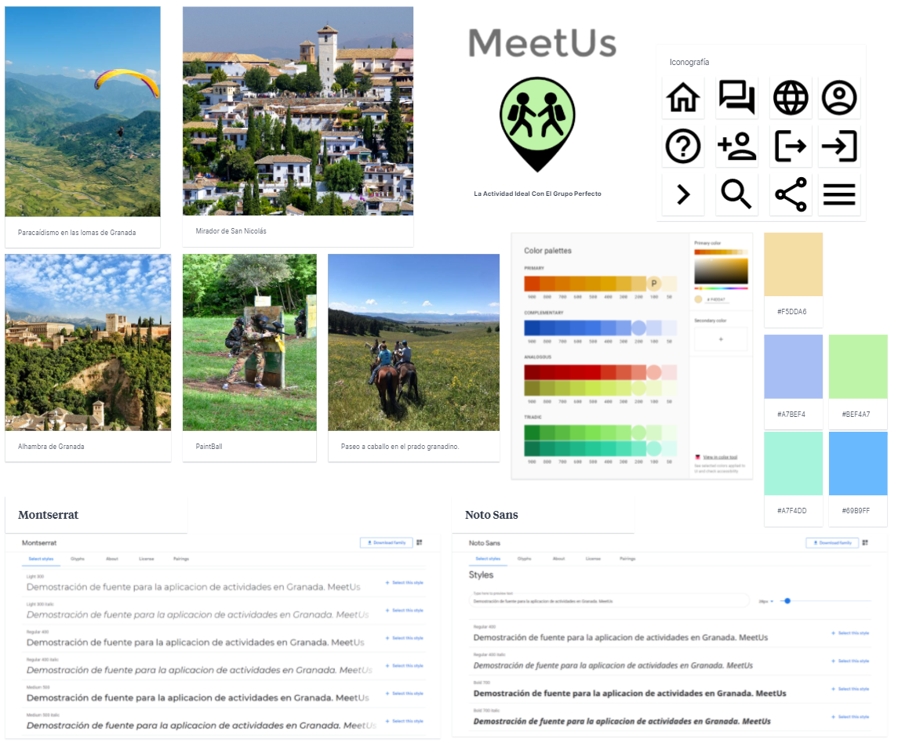
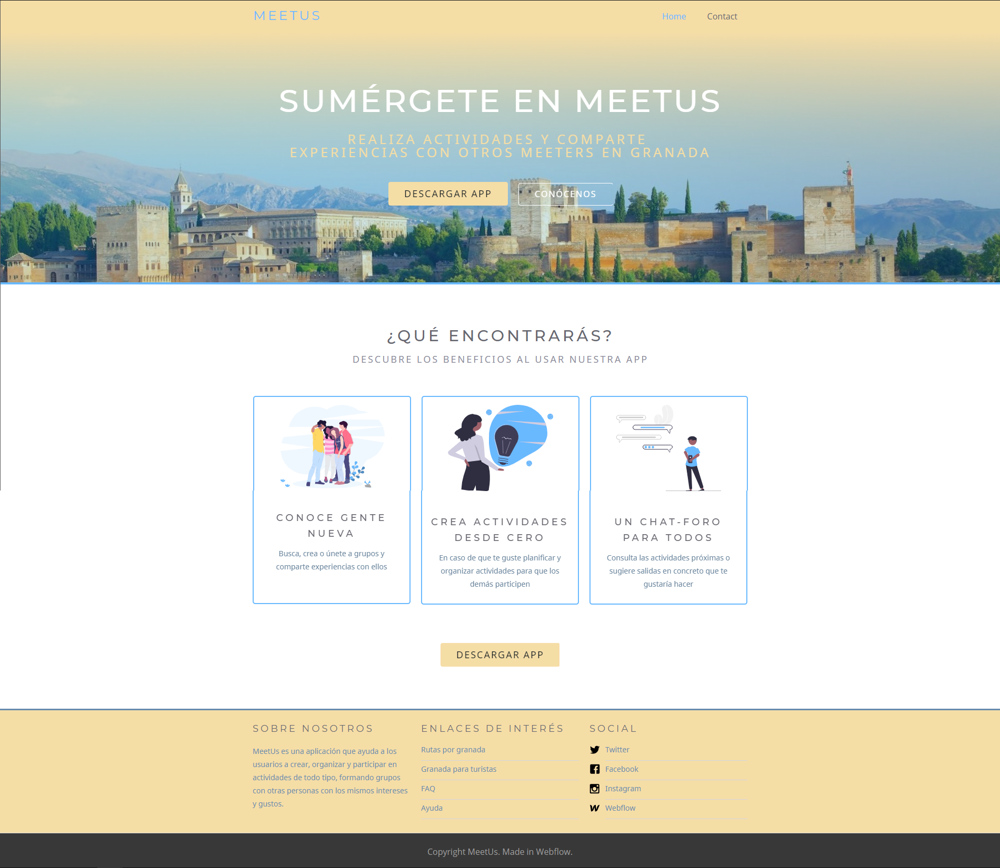
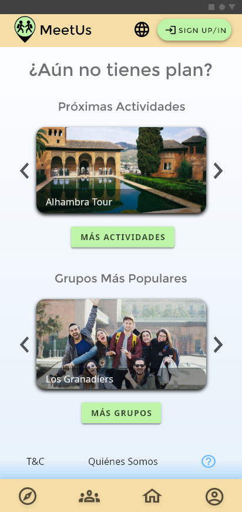
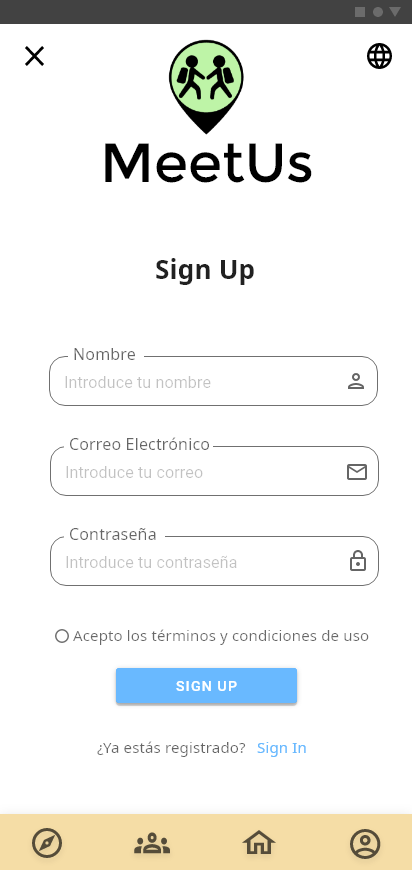
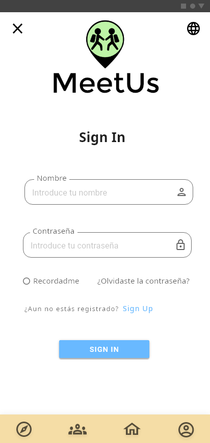
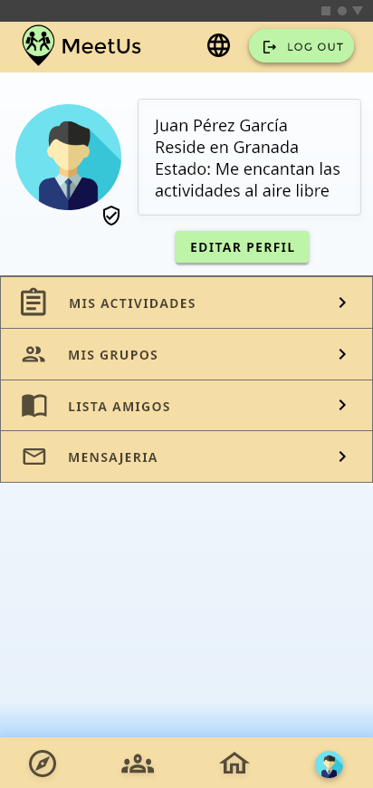
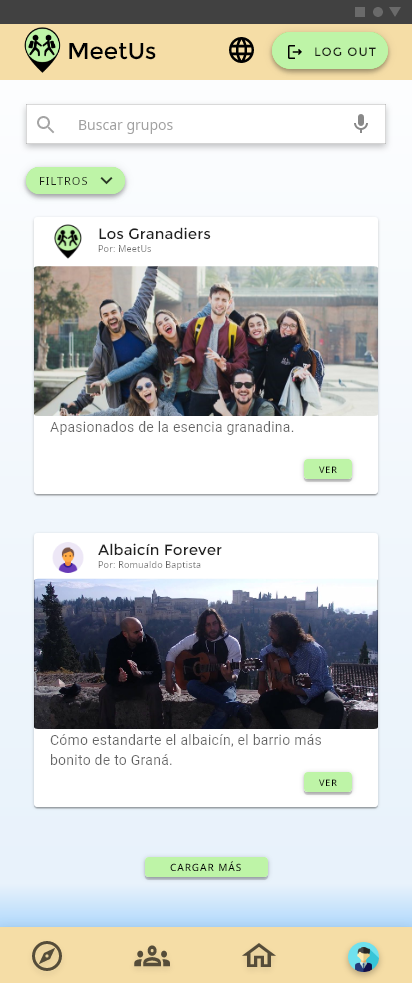
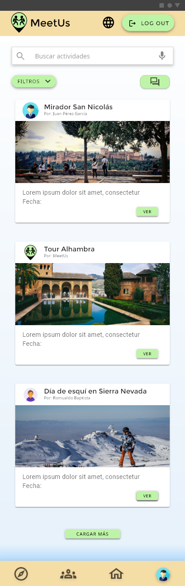

# DIU - Practica 3, entregables

 En esta tercera práctica ya nos enfocamos más en los diseños finales y en el aspecto visual. Para ello, necesitaremos un tablero de inspiracion, estilos de fuentes, una iconografía concreta, paletas de colores, y seguir una serie de patrones de diseño entre otras cosas. Lo vemos a continuación. 
 

## Moodboard (diseño visual + logotipo)   

 Empezamos con un moodboard 
 

## Landing Page

 Diseñamos ahora, ya con el estilo visual en mente, nuestra landing page promocional. Resalta un título y subtítlo atractivos para llamar la atención, tras una imagen representativa de Granada. Justo debajo un CTA bien visible que invita a descargar la aplicación, y otro al final de la página. Y en la sección de beneficios, se refuerza la idea que se queire expresar mediante imágenes representativos extraidos de <a href="https://undraw.co/" target="_blank">Undraw</a> 

 A la hora de realizar la landing page, hemos utilizado la herramienta <a href="https://webflow.com/" target="_blank">WebFlow</a> basándonos en una de sus plantillas predefinidas 'Velocity'.
  

Se puede ver la página en este enlace:
https://meetus.webflow.io/

## Mockup: LAYOUT HI-FI

|  Portada | SignUp |  SignIn |
|---|---|---|
|   |   |   |

| Perfil | Grupos | 
|---|---|
|   |   | 

| Actividades | Actividad |
|---|---|
|   |   |

## Simulación

https://user-images.githubusercontent.com/79632078/118360263-27549880-b587-11eb-8447-6f02131b2986.mp4

## Documentación: Publicación del Case Study

(incluye) Valoración del equipo sobre la realización de esta práctica o los problemas surgidos
 
