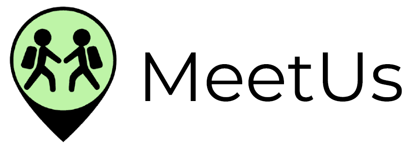
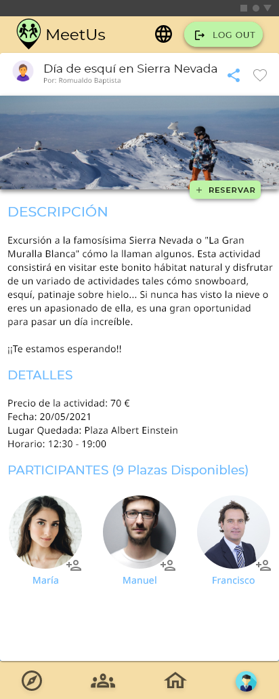

# DIU - Practica 3, entregables

## Moodboard (diseño visual + logotipo)   

 Empezamos con un moodboard, que va a sentar las bases de la apariencia visual de nuestra aplicación en cuanto a colores, tipografías y set de iconos entre otras cosas. Estos aspectos los desarrollaremos un poco más en el apartado de <em>Guidelines</em>. Se ha creado el moodboard a través de <a href="https://milanote.com">Milanote</a>. 

## Landing Page

 Diseñamos ahora, ya con el estilo visual en mente, nuestra landing page promocional que tiene un propósito claro, atraer a gente a la aplicación demostrando sus principales características:

- Resalta un __título y subtítulo atractivos__ para llamar la atención, tras una imagen representativa de Granada. 
- Justo debajo, __la acción principal (CTA)__ bien visible que invita a descargar la aplicación, y otro botón al final de la página (que posiblemente no hiciera falta, pues la página no es tan extensa, ni está recargada con elementos que hagan perder el botón principal). 
- Tras un primer impacto visual nada más entrar a la página, en la __sección de beneficios__ se refuerza la idea que quiere transmitir la app apoyándonos con imágenes representativas extraídas de <a href="https://undraw.co/" target="_blank">Undraw</a>, que ofrece diseños con cualquier color que se indique, por lo que se adaptan perfectamente a cualquier paleta de colores.

 A la hora de realizar la landing page, hemos utilizado la herramienta <a href="https://webflow.com/">WebFlow</a>, usando como partida  una de sus plantillas predefinidas <a href="https://webflow.com/templates/html/velocity-multipurpose-website-template">"Velocity"</a>.

Se puede ver la página en funcionamiento en este enlace <a href="https://meetus.webflow.io/">MeetUs</a>.

## Guidelines y Patrones de Diseño

En términos generales, a la hora de realizar el Mockup de la aplicación móvil, nos hemos adaptado en la medida de lo posible a los <strong>estilos y guías de diseño de Google</strong>. Ofrecen una guía extensa de estos estilos en <a href="https://material.io">material.io</a> acerca del Material Design, principios de un buen uso de la iconografía (aspecto visual de los iconos, tamaños y proporciones, iconos animados, etc), componentes predefinidos listos para usar (<a href="https://material.io/resources">Resources</a>), uso de colores y como aplicarlos en la UI, etc. 

<h3><strong>Diseño Logotipo</strong></h3>

Para la realización del logo primeramente pensamos cómo podríamos representar el concepto de nuestro proyecto visualmente. En un principio decidimos optar por un diseño relacionado con la naturaleza (en parte debido a la elección del moodboard, árboles, senderos, etc), pero la idea del proyecto es que se pueden realizar muchos otros tipos de actividades aparte de aquellas relacionadas con la naturaleza.

Finalmente decidimos que debíamos representar la particularidad de la aplicación respecto a los grupos, y por ello optamos por colocar a 2 'viajeros' en lo que parece ser un encuentro. Todo ello rodeado por el típico símbolo que representa la ubicación, refiriéndose a la multitud de sitios en los cuáles poder quedar y organizar una actividad.

Podemos representar la marca solamente con la parte simbólica, o también combinándolo con texto, lo cual nos da mayor flexibilidad.

|  Isotipo | Imagotipo |
|---|---|
|   |   |

<h3><strong>Paleta de Colores</strong></h3>

Para la paleta de colores optamos en primera instancia por unos tonos verdosos, pero rápidamente vimos que no era muy atractivo a la vista. Optamos por tanto como <strong>color primario</strong> que usaremos para la barra de navegación inferior y la barra superior, un <strong>color cálido</strong> con tonos amarillos/marrones representando el material de múltiples construcciones en Granada, cómo por ejemplo la Alhambra; delegando así el uso del verde claro y el azul como <strong>colores secundarios</strong> para otros componentes como botones, barras de deslizamiento, o algunos encabezados tal y como indica <a href="https://material.io/resources/color/#!/?view.left=0&view.right=0&primary.color=F5DDA6&secondary.color=BEF4A7">esta herramienta de Google</a>.

<h3><strong>Iconografía</strong></h3>

En cuanto a los <a href="https://fonts.google.com/icons">iconos</a> hemos usado los que recomienda Google en su guideline, proporcionándonos un set de iconos sencillos y representativos.

<h3><strong>Tipografía</strong></h3>

Principalmente utilizamos 2 estilos de fuente:
* __MontSerrat__, una fuente sans-serif que gana mucho en sus variantes de más peso (como medium, semi-bold o bold) por lo que la usamos mayoritariamente para títulos, encabezados y algunos botones.
* __Noto Sans__, otra fuente sans-serif y fácil de leer, que utilizamos para el cuerpo y subtítulos. Es una fuente especialmente diseñada por Google con el objetivo de poder ser usada en cualquier parte del mundo, teniendo soporte para más de 800 lenguas diferentes.

<h3><strong>Patrones de Diseño</strong></h3>
En cuanto a los patrones de diseño, en nuestros mockups de la aplicacion móvil y sobre todo en la simulación podemos ver claramente algunos (se han extraídos de <a href="http://www.welie.com/patterns/">welie</a> y <a href="http://ui-patterns.com/patterns">ui-patterns</a>):

- **Navegación**: usamos principalmente navegación mediante barra inferior para saltar a los apartados que más se van a usar, saltos en la jerarquía desde el logo (**_Bottom Navigation Bar_**, **_Home Link_**)
- **Contenido**: cartas de contenido para presentar cada actividad en el listado de actividades durante la búsqueda, posibildad de seleccionar una fecha en el calendario de filtros de actividades, un scroll continuo para contenidos que no caben en una sola página (**_Cards_**, **_Calendar Picker_**, **_Continuous Scrolling_**)
- **Búsqueda**: barra de búsqueda persistente (con el campo de texto siempre visible), y filtrado de resultados (**_Search Box_**, **_Search Filter_**)
- **Interacción básica**: botones que realizan acciones concretas como cambiar de página o reservar una actividad, y el deslizado de imágenes en el home (**_Action Button_**, **_Slideshow_**)
- **Onboarding**: creación de una cuenta o inicio de sesión (**_Account Registration_**, **_Sign In_**)
- **Selector de idiomas**: (**_Language Selector_**)
- **Interacción social**: posibilidad de añadir amigos en la aplicacion, darle me gusta a una actividad concreta, y compartir la actividad en redes sociales (**_Friends_**, **_Reaction_**, **_Auto-Sharing_**)

## Mockup: LAYOUT HI-FI

|  Portada | SignUp |  SignIn |
|---|---|---|
|   |   |   |

| Perfil | Grupos | 
|---|---|
|   |   | 

| Actividades | Descripcion Actividad |
|---|---|
|   |   |

## Simulación
> Podemos ver en este vídeo la simulación de nuestra app

https://user-images.githubusercontent.com/79632078/118360263-27549880-b587-11eb-8447-6f02131b2986.mp4

## Documentación: Publicación del Case Study

> Valoración del equipo y problemas surgidos

En términos generales esta práctica nos ha requerido mucho esfuerzo y tiempo, y nos hace ver lo difícil que es realizar un buen diseño, ya sea de una interfaz de usuario funcional, o de una landing page llamativa. Hay que tener muy claro en todo momento los estilos y las guías a seguir, escoger una buena paleta de colores (que no es fácil) y saber qué tipografías son mejores para la lectura, o cuáles son buenas para enfatizar y dar fuerza en según que situaciones. 

Ha sido bastante interesante de realizar puesto que ya nos ponemos manos a la obra en diseñar nuestra propia página/aplicación. Al principio nos costó escoger la paleta de colores, y cambiamos varias veces de tipografía puesto que no se adecuaban bien con nuestro proyecto. Ha sido un proceso complejo y de alguna manera entretenido, haciendo replantearnos ciertos aspectos que parecía teníamos muy claros, por ejemplo algunos ligeros cambios con respecto al diseño de los Lo-Fi Wireframes de la práctica anterior para adaptarnos mejor al resultado que queríamos.

Comentar también nuestro paso por Adobe XD. Al principio la curva de aprendizaje es compleja ya que hay bastantes menús, la interacción del ratón con los elementos complejos es muy extraña (no sabes muy bien donde pinchar para seleccionar algo), y en nuestro caso, a la hora de trabajar de manera cooperativa el programa daba algunos errores graves de ejecución y no iba fluido que digamos. En cambio es bastante flexible, ya que permite hacer prácticamente cualquier diseño si conoces bien la herramienta, y tiene bastantes opciones de transiciones y animaciones que se pueden personalizar, facilitando también simular el funcionamiento real de la app.

Por lo demás, estamos bastante satisfechos con el resultado.

