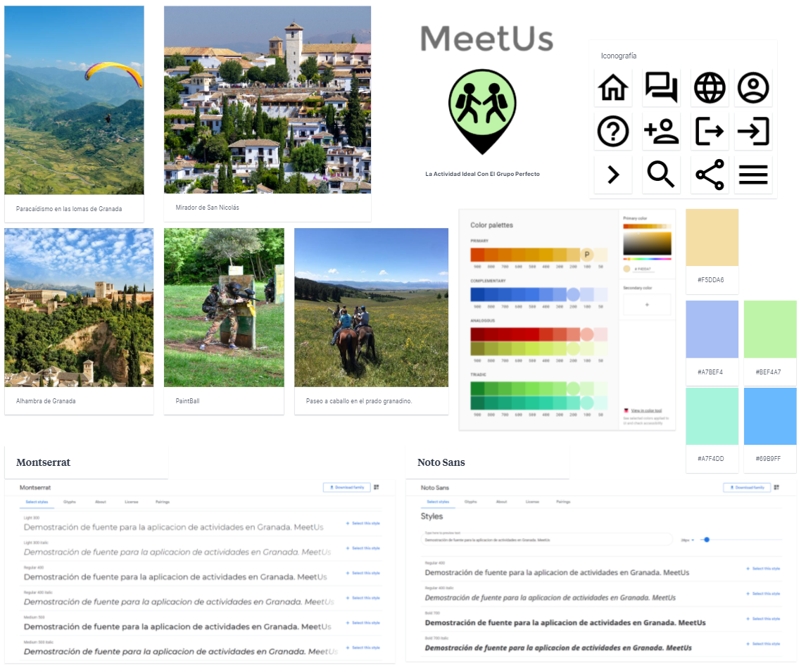
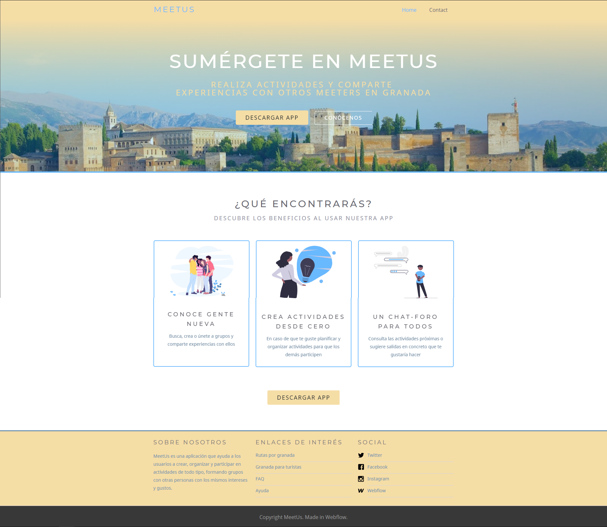

# DIU - Practica 3, entregables

 En esta tercera práctica ya nos enfocamos más en los diseños finales y en el aspecto visual. Para ello, necesitaremos un tablero de inspiracion, estilos de fuentes, una iconografía concreta, paletas de colores, y seguir una serie de patrones de diseño entre otras cosas. Lo vemos a continuación. 
 

## Moodboard (diseño visual + logotipo)   

 Empezamos con un moodboard 
 

## Landing Page
A la hora de realizar la landing page, hemos utilizado la herramienta WebFlow basándonos en una de sus plantillas predefinidas 'Velocity'.

Se puede ver la página en este enlace:
https://meetus.webflow.io/

## Mockup: LAYOUT HI-FI

## Simulación

https://user-images.githubusercontent.com/79632078/118360263-27549880-b587-11eb-8447-6f02131b2986.mp4

## Documentación: Publicación del Case Study

(incluye) Valoración del equipo sobre la realización de esta práctica o los problemas surgidos
 
