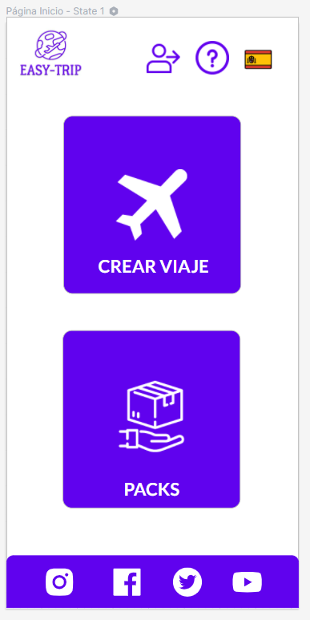
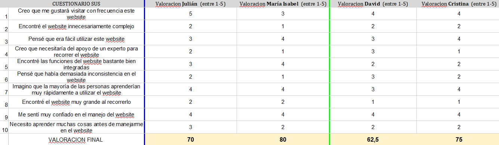

# DIU - Practica 4, entregables

Lista de proyectos (en github) https://github.com/mgea/DIU20/blob/master/P4/proyectos.md

<h1 align="center">Informe de Usabilidad</h1>

 Aqui iría una fotillo 

<h1 align="center">Prototipo Web / Equipo: </h1>

https://github.com/meryuree/DIU21

<strong>26/05/2021</strong>

</img>

<h3>Descripción del Website</h3>
Se trata de una página sencilla, clara e intuitiva dónde poder elegir y planificar un viaje inolvidable en sólo 5 pasos.

<h3>Resumen Ejecutivo</h3>

<h3>Metodología</h3>

<h3>Personajes</h3>

|  IdUsuaro | Sexo/Edad | Ocupación | Exp.TIC | Plataforma | Cubierto | Test | SUS Score |
|---|---|---|---|---|---|---|---|
| 1 | Mujer (23) | Estudiante | Media/Alta | App Móvil | Tipo: 1  Actividad: 5  Estado: Sorprendida| 7 | 8 | 
| 2 | Hombre (45) | Mecánico de Camiones | Baja | Windows | Tipo: 3  Actividad: 3  Estado: Enfadado| 6 | 1 | 

<h3>Cuestionario SUS</h3>

</img>

<h3>Recomendaciones</h3>

<h3>Conclusión</h3>

## Caso 1

Descripcion y hoja de valoración.    

## Caso 2

Descripcion y hoja de valoración.  

## Caso 3

Descripcion y hoja de valoración.   

## User Testing

	Describe la experiencia 1

	Describe la experiencia 2

	Describe la experiencia 3

## Conclusiones
