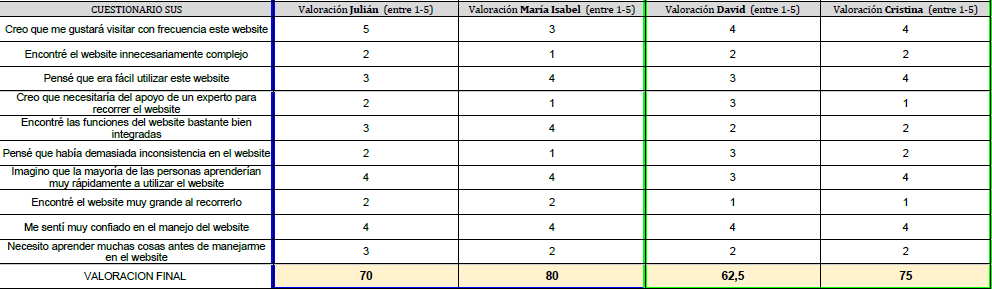

# DIU - Practica 4, entregables

<h1 align="center">Informe de Usabilidad</h1>

<h1 align="center">Prototipo Web / Equipo: </h1>

https://github.com/meryuree/DIU21  DIU1_PARAGUAS

<strong>26/05/2021</strong>

</img>

<h3>Descripción del Website</h3>
Se trata de una página sencilla, clara e intuitiva dónde poder elegir y planificar un viaje inolvidable en sólo 5 pasos.

<h3>Personajes</h3>

|  IdUsuaro | Sexo/Edad | Ocupación | Exp.TIC | Plataforma | Perfil | Test | SUS Score |
|---|---|---|---|---|---|---|---|
| Julián | Hombre (57) | Encargado Ferretería | Baja/Media | App Móvil | Julián es un enamorado de la gastronomía andaluza y solía recorrerse las provincias de restaurante en restaurante con su mujer. Desgraciadamente falleció hace 1 año y dejó este hobby. Recientemente se ha animado a retomar su pasión,  está en busca de personas que la compartan y de nuevos destinos culinarios. | MeetUs | 70 | 
| María Isabel | Mujer (43) | Dueña de una Papelería | Media | App Móvil | María Isabel es poseedora de una pequeña papelería en la capital de Granada, es introvertida y no le gusta estar rodeada de un gran número de personas. Uno de sus objetivos personales es revivir la historia de la antigua capital nazarí recorriendo aquellos lugares históricos de los que tanto ha leído en los libros. | MeetUs | 80 |
| David | Hombre (20) | Estudiante INEF UGR | Baja/Media | App Móvil | David es un chico muy activo físicamente que le encanta conocer mundo y este año está de Erasmus en Crackovia (Polonia). En los fines de semana que tenga más libre le gustaría hacer una escapada a países de la zona (Centro Europa) para seguir descubriendo nuevas culturas, arte … | EasyTrip | 62.5 | 
| Cristina | Mujer (34) | Fotógrafa Profesional | Alta | App Móvil | Cristina es una apasionada de la fotografía que trabaja para National Geographic y es la encargada de organizar los viajes del equipo de grabación. Cada 2 o 3 semanas necesitan hacer un viaje a un país distinto para la elaboración de un nuevo programa.  | EasyTrip | 75 |

<h3>A/B Testing</h3>

Vemos el resultado del cuestionario SUS, realizado por los personajes. Para ver el cuestionario completo [pulse aquí] (https://github.com/angelsc21/DIU21/blob/master/P4/Cuestionario.pdf)

</img>

<h3>Tareas realizadas</h3>

Puedes ver el documento pdf del UX Case Study [aqui](https://github.com/angelsc21/DIU21/blob/master/P4/UXCaseStudy-review_PARAGUAS.pdf)

<h3>Usability Report (Caso B)</h3>

Puedes ver el documento pdf del Usability Report del caso B [aquí](https://github.com/angelsc21/DIU21/blob/master/P4/UsabilityReportB.pdf)

## Conclusiones
Esta práctica nos ha parecido bastante interesante en el sentido de que no es tan fácil juzgar los trabajos de otros. A priori cosas que ellos han pensado que se darían por entendidas, nosotros no las hemos interpretado de la misma manera. Esto hace que nos demos cuenta de lo cuidadoso que tienes que ser con cada detalle de tu producto/proyecto, ya que el usuario puede llegar a pensar muy diferente a lo que lo haría un desarrollador/diseñador. 

Cómo hemos mencionado en la conclusión del Usability Report nos parece que han hecho un buen trabajo adaptado a lo que se pedía en las prácticas, a excepción de algunas aspectos que hemos remarcado.
