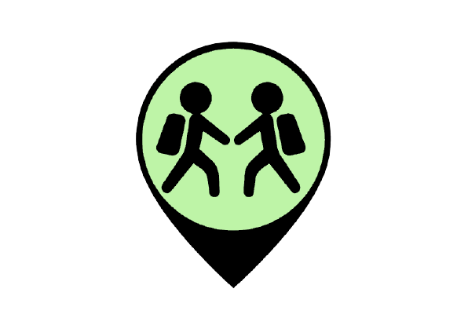
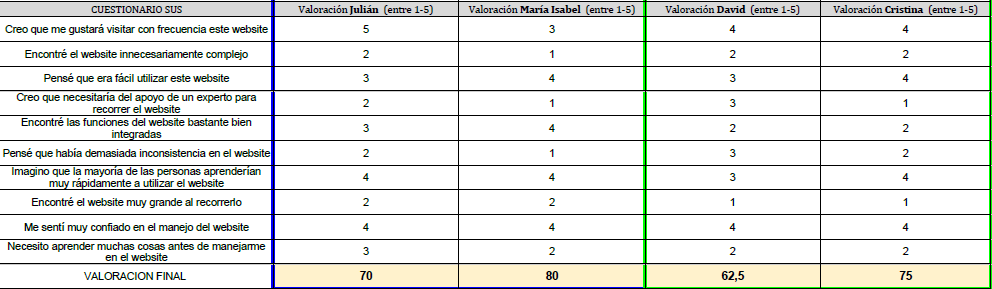

# DIU21
Prácticas Diseño Interfaces de Usuario 2020-21 (Tema: Experiencias y planificación de ocio) 

Grupo: DIU3.nmsc  Curso: 2020/21 
Updated: 15/05/2021

Proyecto: MeetUs

Descripción:

Meetus consiste en un aplicación móvil dedicada a la realización de actividades en Granada. Permite a los usuarios crear, organizar, participar, y proponer actividades de todo tipo, formando grupos con otras personas con los mismos intereses y gustos. La finalidad se basa en conocer más a fondo la provincia de Granada y hacerlo en presencia de una gran compañía. 

Logotipo:

Miembros
 * :boy:   Jesús Navarro Merino   :octocat: ([@Jesnm01](https://github.com/Jesnm01))
 * :boy:  Ángel Solano Corral     :octocat: ([@angelsc21](https://github.com/angelsc21))

----- 

# Proceso de Diseño 

## Paso 1. UX Desk Research & Analisis 

 1.a Competitive Analysis
-----
> Antes de desarrollar MeetUs realizamos la comparación de varias plataformas que competían entre ellas (Civitatis, SpainInfo, BuscoUnViaje). Nos acabamos quedando por civitatis concluyendo que era la más completa (más información sobre la decisión <a href="https://github.com/angelsc21/DIU21/tree/master/P1">aquí</a>). 

 1.b Persona
-----
> Usamos 2 perfiles de usuario totalmente distintos que usaremos en el siguiente apartado para tratar de averiguar las carencias de Civitatis. Por un lado tenemos a Pedro (padre de familia, torpe tecnológicamente hablando, viaje familiar, etc) y por otro a Irene (universitaria, poco dinero, viaje con amigas ...). Puedes descubrir más características de ellos <a href="https://github.com/angelsc21/DIU21/tree/master/P1">aquí</a>.

 1.c User Journey Map
----
> En la búsqueda de errores creamos 2 experiencias de usuario con las personas ficticias que tenemos creadas. Si quieres ver cómo acabó pincha <a href="https://github.com/angelsc21/DIU21/tree/master/P1">aquí</a>.

 1.d Usability Review
----
> Realizamos un análisis exhaustivo de Civitatis para distinguir sus puntos fuertes y sus debilidades. Acabó con una valoración de 79/100, los detalles del estudio se encuentran <a href="https://github.com/angelsc21/DIU21/tree/master/P1">aquí</a>.

## Paso 2. UX Design  

 2.a Feedback Capture Grid / EMpathy map / POV
----
> A través de una <a href="https://github.com/angelsc21/DIU21/tree/master/P2">malla receptora</a> de información recopilamos los puntos más interesantes, críticas, preguntas y posibles nuevas ideas.

 2.b ScopeCanvas
----
> Cómo propuesta de valor definimos que nuestro proyecto consistirá en una aplicación clara, sencilla y funcional para todos aquellos usuarios que deseen realizar actividades en la provincia de Granada solos o disfruntando de la mejor compañía. Si quieres entrar más en detalle acerca de la propuesta y el tablón Scope Canvas entre <a href="https://github.com/angelsc21/DIU21/tree/master/P2#propuesta-de-valor">aquí</a>.

 2.b Tasks analysis 
-----
> Creamos una <a href="https://github.com/angelsc21/DIU21/tree/master/P2#task-analysis">Task Matrix</a> definiendo una serie de grupos de usuario y reflejamos la frecuencia con la que se realizan según qué acciones dentro de la aplicación, averiguando así las de mayor importancia.

 2.c IA: Sitemap + Labelling 
----
> Para tener clara la estructura de la aplicación elaboramos el <a href="https://github.com/angelsc21/DIU21/tree/master/P2#arquitectura-de-informaci%C3%B3n">Sitemap</a>, que nos ayuda a visualizar la jerarquía de páginas y definir la navegabilidad entre ellas. 
Describimos también las etiquetas que representan cada sección de la aplicación en esta <a href="https://github.com/angelsc21/DIU21/tree/master/P2">tabla</a>.

 2.d Wireframes
-----
> Y ya para finalizar esta fase de diseño preliminar y estructuración, realizamos unos cuantos <a href="https://github.com/angelsc21/DIU21/tree/master/P2#prototipo-lo-fi-wireframe">bocetos</a> de la aplicación para tener una primera toma de contacto e idear cómo sería el resultado final. Los bocetos no representan el 100% de la aplicación, puesto que faltan algunas pantallas, pero elegimos los de mayor uso para ver el resultado.

## Paso 3. Mi UX-Case Study (diseño)

 3.a Moodboard
-----
> Diseñamos un <a href="https://github.com/angelsc21/DIU21/tree/master/P3#moodboard-dise%C3%B1o-visual--logotipo">moodbard</a> que va a sentar las bases de la apariencia visual de nuestra aplicación en cuanto a colores, tipografías y set de iconos entre otras cosas.

  3.b Landing Page
----
> A modo de página llamativa para atraer a usuarios creamos una <a href="https://github.com/angelsc21/DIU21/tree/master/P3#landing-page">Landing Page</a>.

 3.c Guidelines y Patrones de Diseño
----
> Puedes mirar los guidelines y patrones seguidos para crear la aplicación <a href="https://github.com/angelsc21/DIU21/tree/master/P3#guidelines-y-patrones-de-dise%C3%B1o">aquí</a>.

  3.d Mockup y simulación
----
> Pasamos de los bocetos anteriores a unos diseños realistas de la aplicación con colores ... Puedes ver los diseños y un vídeo demostrativo <a href="https://github.com/angelsc21/DIU21/tree/master/P3#mockup-layout-hi-fi">aquí</a>.

 3.e ¿My UX-Case Study?
-----
> Hacemos una <a href="https://github.com/angelsc21/DIU21/tree/master/P3#documentaci%C3%B3n-publicaci%C3%B3n-del-case-study">valoración</a> acerca de qué nos ha parecido esta práctica y los problemas que nos han surgido.

## Paso 4. Evaluación 

 4.a Caso asignado
----
EasyTrip se trata de una página sencilla, clara e intuitiva dónde poder elegir y planificar un viaje inolvidable en sólo 5 pasos. 

La plataforma se basa en ofrecer 2 opciones a los clientes:
	- Viaje personalizado: Es el usuario quién se encarga de decidir los detalles del viaje.
	- Pack: Viajes ya planificados por la plataforma.

Puedes ver encontrar más información de su proyecto en su [repositorio de github](https://github.com/meryuree/DIU21)

 4.b User Testing
----
Para ver la descripción completa de los personajes [pulse aquí](https://github.com/angelsc21/DIU21/tree/master/P4)
|  IdUsuaro | Sexo/Edad | Ocupación | Exp.TIC | Plataforma | Personalidad | Test A/B |
|---|---|---|---|---|---|---|
| Julián | Hombre (57) | Encargado Ferretería | Baja/Media | App Móvil  | Extrovertido/Racional | MeetUs | 
| María Isabel | Mujer (43) | Dueña de una Papelería | Media | App Móvil | Introvertida/Soñadora | MeetUs |
| David | Hombre (20) | Estudiante INEF UGR | Baja/Media | App Móvil | Atlético/Activo | EasyTrip | 
| Cristina | Mujer (34) | Fotógrafa Profesional | Alta | App Móvil | Profesional/Activa | EasyTrip |

. 4.c Cuestionario SUS
----

El test A sobre nuestra plataforma lo han realizado Julián y María Isabel. Ha servido de apoyo para el test B que lo han hecho David y Cristina. Los resultados han sido:

 4.d Usability Report
----

Puedes encontrar el Usability Report del Caso B [aquí](https://github.com/angelsc21/DIU21/blob/master/P4/P4_UsabReport_EasyTrip_doneby_DIU3_nmsc.pdf)

## Conclusión final / Valoración de las prácticas

>>> (90-150 palabras) Opinión del proceso de desarrollo de diseño siguiendo metodología UX y valoración (positiva /negativa) de los resultados obtenidos  

